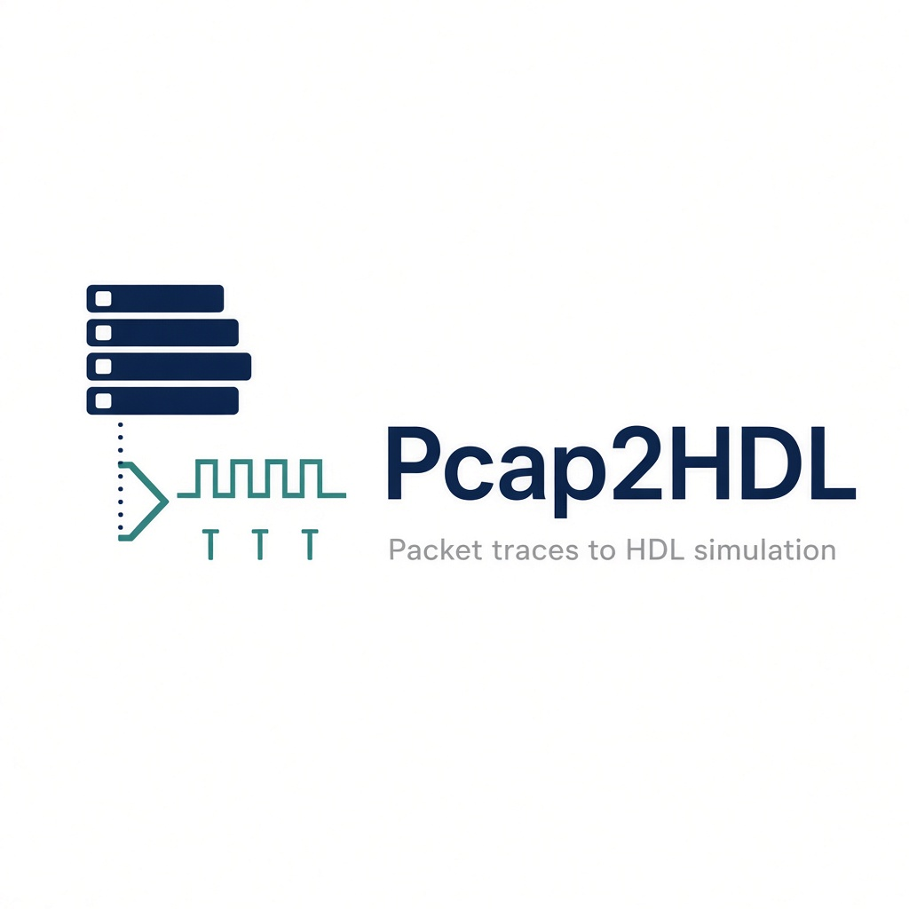

<p align="center">
  
</p>

# Pcap2HDL

Replay captured network traces in a cycle-accurate SystemVerilog simulation.

Pcap2HDL streams `.pcap` files into Verilator through DPI-C (`libpcap`). Each captured byte is driven on an AXI-Stream-like bus (`tdata`, `tkeep`, `tvalid`, `tready`, `tstart`, `tlast`) so hardware under test can see the same frames a NIC would, with simulation time frozen for debug. Default width is 8 bits (one byte per cycle); `make AXIS_W=64` packs eight bytes per beat. DUT modules accept a beat only when `tvalid && tready`.

Typical uses: early bring-up of FPGA or ASIC packet pipelines (classification, DPI, RoCE-aware paths) before silicon or a live Ethernet port is available.

Current release: [0.3.0](CHANGELOG.md). Project site: [khademullah.github.io/Pcap2HDL](https://khademullah.github.io/Pcap2HDL/).

## Requirements

Linux (Ubuntu is the reference environment), Verilator 5.032 or later, and:

```bash
sudo apt update
sudo apt install build-essential libpcap-dev
```

GTKWave is optional (`make wave`). Soft-RoCE capture additionally needs `rdma-core`, `ibverbs-utils`, and `tcpdump`; see `docs/soft_roce_veth.md`.

## Layout

| Path | Role |
|------|------|
| `Makefile` | Compile, run, waveforms, clean |
| `hdl/` | SystemVerilog testbench and DUT |
| `hdl/tb_pcap_dpi.sv` | DPI imports, AXI-Stream driver, plusargs |
| `hdl/pkt_size_filter.sv` | Frame length: runt / standard / jumbo |
| `hdl/pkt_header_parser.sv` | L2–L4 parse; TCP; Soft-RoCE BTH |
| `hdl/pkt_roce_tracker.sv` | RoCE PSN / MSG_DONE / ACK_OK |
| `hdl/pkt_tcp_tracker.sv` | TCP handshake and next-seq |
| `hdl/pkt_roce_icrc.sv` | RoCEv2 ICRC |
| `hdl/pkt_rss.sv` | NIC RSS Toeplitz; compared with DPI-C |
| `hdl/pkt_ip_csum.sv` | IPv4 header checksum; compared with DPI-C |
| `dpi/pcap_reader.c` | libpcap DPI-C: read, BPF, dump, RSS, IPv4 csum |
| `traffic.pcap` | Local iperf TCP trace (not in git) |
| `soft_roce.pcap` | Local Soft-RoCEv2 trace from `scripts/soft_roce_veth.sh` |
| `docs/` | Capture notes, stills, GitHub Pages (`index.html`) |
| `examples/` | Reference simulation logs |
| `scripts/soft_roce_veth.sh` | veth + RXE + `ibv_rc_pingpong` capture helper |
| `scripts/gen_pcap.py` | Tiny ARP/TCP/VXLAN/runt pcap (stdlib) |
| `.github/workflows/ci.yml` | Generate `ci.pcap` and `make BP=2` |

## Data path

```
.pcap  ->  libpcap BPF (optional FILTER)  ->  DPI-C  ->  AXI-Stream DUT
                                                              ->  pkt_size_filter
                                                              ->  pkt_header_parser
                                                              ->  pkt_roce_tracker
                                                         ->  pkt_tcp_tracker
                                                         ->  pkt_roce_icrc
                                                         ->  pkt_rss
                                                         ->  pkt_ip_csum
                                         optional dump.pcap <- libpcap
```

1. `open_pcap()` opens the file named by `+PCAP=`; `get_datalink()` reports the capture DLT. Optional `+FILTER=` compiles a libpcap BPF program; DPI-C applies `pcap_offline_filter` per frame so HDL only sees matches and the bench reports how many frames were skipped. Optional `+DUMP=` writes accepted AXI-Stream bytes back through `pcap_dump`.
2. Packets are replayed up to `+MAX_PACKETS=` (default 100). After each `fetch_next_packet()`, `get_wire_len()` / `get_ts_sec()` / `get_ts_usec()` expose the pcap header (on-wire length vs stored `caplen`, capture timestamp).
3. Bytes are updated on the clock negedge and sampled by the DUT on posedge when `tready` is high. With `AXIS_W=64`, up to eight bytes share a beat (`tkeep` marks valid lanes). `make BP=1` deasserts `tready` every other cycle; `make BP=2` uses `$urandom`. The master holds `tvalid` until the handshake.
4. `pkt_size_filter` counts `tkeep` bits and pulses `pkt_done` with length class.
5. `pkt_header_parser` latches MAC, EtherType, IPv4 (TTL, total length), L4 ports, TCP sequence/flags, RoCE BTH, ARP (`0x0806`), and VXLAN (UDP/4789, inner Ethernet, VNI).
6. `pkt_roce_tracker` follows Send First/Middle/Last PSN per `{src,dst,qp}` and matches the reverse-direction ACK.
7. `pkt_tcp_tracker` follows SYN / SYN-ACK / ACK (`HS_DONE`) and then next expected seq from TCP payload length.
8. `pkt_roce_icrc` checks the last 4 bytes of a complete RoCEv2 frame (masked CRC32). Truncated captures are skipped.
9. `pkt_rss` computes Microsoft Toeplitz RSS on the IPv4 4-tuple (queue = hash % 4). DPI-C hashes the same bytes into `tuser`; `mis` must stay 0.
10. `pkt_ip_csum` folds the IPv4 header (RFC 1071) and compares with DPI-C (`CSUM mis=0`). `tuser_err` flags a C-side checksum fail without changing the RSS hash.

## Build and run

```bash
make                              # traffic.pcap, 100 packets
make PCAP=soft_roce.pcap          # Soft-RoCEv2
make PCAP=soft_roce.pcap MAX_PACKETS=16
make PACE=1                       # IFG from pcap timestamps (capped at 100 us)
make BP=1                         # tready low every other cycle
make BP=2                         # random tready
python3 scripts/gen_pcap.py ci.pcap
make PCAP=ci.pcap MAX_PACKETS=8 BP=2
make AXIS_W=64                    # 8-byte AXI-Stream beats
make DUMP=replay.pcap             # write the bus back to a pcap
make FILTER='tcp port 5201'       # libpcap BPF; HDL only sees matches
make FILTER='udp'                 # no UDP in traffic.pcap; streamed 0
make PCAP=soft_roce.pcap FILTER='udp port 4791'
make wave                         # GTKWave on simulation_trace.vcd
make clean
```

Traces are selected at runtime; a rebuild is not required when only `PCAP` or `MAX_PACKETS` changes. Changing `AXIS_W` rebuilds.

## Example: TCP (`traffic.pcap`)

```bash
make
```

One `[HDR]` line is printed when headers are valid (after L4 ports for TCP/UDP). One `[DUT]` line follows `tlast`. DPI reports DLT, stored vs on-wire length, and the pcap timestamp. MAC swap with a stable `192.168.1.1` / `192.168.1.2` pair is a two-host iperf conversation.

```
[SV] Datalink DLT=1 (Ethernet)
[SV] Processing Packet #1 (captured 74 / wire 74 bytes) ts=1788332455.060537
[HDR] ... IPv4 ttl=64 iplen=60  192.168.1.1:42262 -> 192.168.1.2:5201  TCP SYN seq=0x5803f137 ack=0x00000000 plen=0
[TCP] SYN_OK
[DUT] Classified packet: 74 bytes -> STANDARD
[SV] Processing Packet #2 ...
[HDR] ... IPv4 ttl=64 iplen=60  192.168.1.2:5201 -> 192.168.1.1:42262  TCP SYN ACK seq=0x15c9e53f ack=0x5803f138 plen=0
[TCP] SYNACK_OK
...
[TCP] HS_DONE
...
[TCP] SEQ_OK
...
[DUT] Header  ipv4=8  tcp=8  udp=0  roce=0  other=0  trunc=0
[DUT] TCP     hs=1  fin=0  rst=0  seq_ok=5  seq_err=0  op_err=0
[DUT] Length  mismatch=0
[DUT] ICRC    ok=0  err=0  skip=0
[DUT] RSS     q0=5  q1=0  q2=3  q3=0  mis=0  skip=0
```

Waveform: `docs/gtkwave_8pkt.jpg`. Each `tvalid` burst is one frame (`tstart` / `tlast`). At millisecond zoom the 10 ns clock looks solid; zoom into a burst to see edges.

### Round-trip dump (`replay.pcap`)

```bash
make DUMP=replay.pcap
make PCAP=replay.pcap
```

`DUMP` writes accepted AXI-Stream bytes (`tvalid && tready`) back through libpcap. Replaying that file must match the original DUT summary (`hs=1 seq_ok=5 seq_err=0`). Wireshark opens `replay.pcap` as Ethernet: the same eight frames (SYN, SYN-ACK, ACK, then iperf PSH/ACK, 103-byte cookie on packet 4). Still: `docs/wireshark_replay.png`.

### BPF filter (`+FILTER=`)

libpcap compiles the expression (`pcap_compile`). DPI-C does not call `pcap_setfilter`; each frame goes through `pcap_offline_filter` so skipped packets are counted. The DUT is unchanged: it only ever sees frames that pass BPF. `MAX_PACKETS` counts matches, not raw file order. Skip is frames walked over while filling that cap (unread tail of the file is neither match nor skip).

```bash
make FILTER='tcp port 5201'
```

```
[C-DPI] BPF filter: tcp port 5201
[SV] Streaming up to 100 packets FILTER=tcp port 5201
[HDR] ... 192.168.1.1:34612 -> 192.168.1.2:5201  TCP SYN ... plen=0
[TCP] SYN_OK
...
[C-DPI] BPF matched=100 skipped=0
```

A miss still opens the file; `pcap_next()` returns nothing for HDL:

```bash
make FILTER='udp'
```

```
[C-DPI] BPF filter: udp
[SV] Reached end of PCAP before hitting the packet cap.
[C-DPI] BPF matched=0 skipped=1000
[SV] Simulation finished. File=traffic.pcap  Streamed 0 packets.
[DUT] Header  ipv4=0  tcp=0  udp=0  roce=0  other=0  trunc=0
```

Soft-RoCE is UDP/4791, so the same knob keeps the RoCE DUT and drops TCP:

```bash
make PCAP=soft_roce.pcap FILTER='udp port 4791'
```

```
[C-DPI] BPF filter: udp port 4791
[HDR] ... 192.168.10.1:49441 -> 192.168.10.2:4791  ROCE SEND_LAST ... AckReq
[TRK] MSG_DONE
[DUT] ICRC  8a401571 OK
[HDR] ... ROCE ACK ...
[TRK] ACK_OK
[DUT] ICRC  dabe7a49 OK
[DUT] Header  ipv4=8  tcp=0  udp=0  roce=8  other=0  trunc=0
[DUT] Tracker msg=1  ack=1  psn_err=0  op_err=0  psn_gap=0
[DUT] ICRC    ok=8  err=0  skip=0
```

A 1000-packet veth capture can stay one file: `make FILTER='tcp port 5201'` streams 100 matches (`skipped=0` if the head of the file is all TCP); `make FILTER='udp'` streams 0 and reports `skipped=1000`.

## Example: Soft-RoCE (`soft_roce.pcap`)

```bash
make PCAP=soft_roce.pcap
make PCAP=soft_roce.pcap MAX_PACKETS=16
make PCAP=soft_roce.pcap FILTER='udp port 4791'
```

UDP/4791 frames are tagged `ROCE` with BTH opcode, dest QP, and PSN. The tracker emits `OK` on in-order fragments, `MSG_DONE` on Send Last, and `ACK_OK` on the matching reverse ACK. An 8-packet cap finishes mid-message in the reverse direction (`msg=1 ack=1`). `MAX_PACKETS=16` completes three messages (`msg=3 ack=3`, three runt ACKs) and starts the next Send. Logs: `examples/traffic_8pkt.log`, `examples/soft_roce_8pkt.log`, `examples/soft_roce_16pkt.log`.

```
[HDR] ... IPv4 ttl=64 iplen=1068  192.168.10.1:49441 -> 192.168.10.2:4791  ROCE SEND_LAST qp=0x11 psn=0xe1b96f pkey=0xffff AckReq
[TRK] MSG_DONE
[HDR] ... IPv4 ttl=64 iplen=48  192.168.10.2:49441 -> 192.168.10.1:4791  ROCE ACK qp=0x11 psn=0xe1b96f pkey=0xffff
[TRK] ACK_OK
[DUT] Classified packet: 62 bytes ->     RUNT
[DUT] ICRC  dabe7a49 OK
...
[DUT] Header  ipv4=8  tcp=0  udp=0  roce=8  other=0  trunc=0
[DUT] Tracker msg=1  ack=1  psn_err=0  op_err=0  psn_gap=0
[DUT] Length  mismatch=0
[DUT] ICRC    ok=8  err=0  skip=0
```

Capture a new file with `sudo ./scripts/soft_roce_veth.sh setup` then `demo` (`docs/soft_roce_veth.md`).

## Status

- Environment: DPI-C pcap stream into Verilator (bytes, wire length, timestamp, DLT)
- Control: packet cap and clean exit
- Size filter: runt / standard / jumbo (`tkeep` popcount)
- L2/L3: MAC, EtherType, IPv4 TTL and total length (LEN_MISMATCH vs captured)
- L4: TCP/UDP ports; TCP flags, seq, ack
- RoCEv2 BTH: opcode, dest QP, PSN, P_Key, AckReq
- RoCEv2 ICRC: last 4 bytes checked; truncated captures skipped
- Tracker: RoCE PSN/ACK and next-message PSN_GAP; TCP SYN / SYN-ACK / HS_DONE / next-seq (`plen`) / FIN / RST
- RSS: Toeplitz 4-tuple in C and HDL (`tuser`); four queues, `mis=0`
- IPv4 checksum: RFC 1071 in C and HDL (`CSUM mis=0`); `tuser_err` is fail sideband
- ARP (`0x0806`) and VXLAN (UDP/4789, VNI, inner Ethernet)
- Replay: optional `+PACE=1` IFG from pcap timestamps (capped); `AXIS_W=64` eight-byte beats; `tready` handshake (`+BP=1` 50%, `+BP=2` random); `DUMP=` writes the bus back to a pcap; `FILTER=` is libpcap BPF (`pcap_offline_filter`) with `matched` / `skipped` counts
- Coverage print `[COV]` size / TCP flags / RoCE opcodes. CI: `.github/workflows/ci.yml` + `scripts/gen_pcap.py`

Still parked: IPv6, VLAN. See [CHANGELOG.md](CHANGELOG.md). How to contribute, and why the parked items are good first PRs: [CONTRIBUTING.md](CONTRIBUTING.md).

## License

See `LICENSE`.
