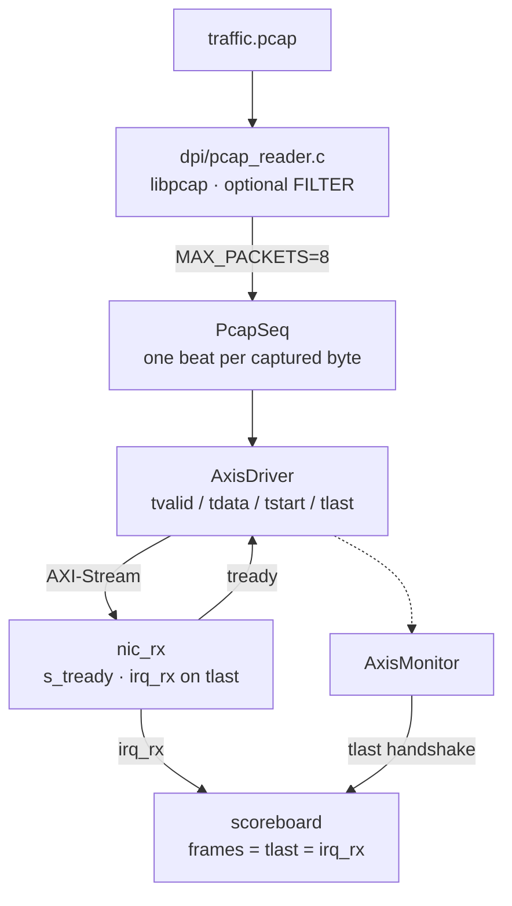
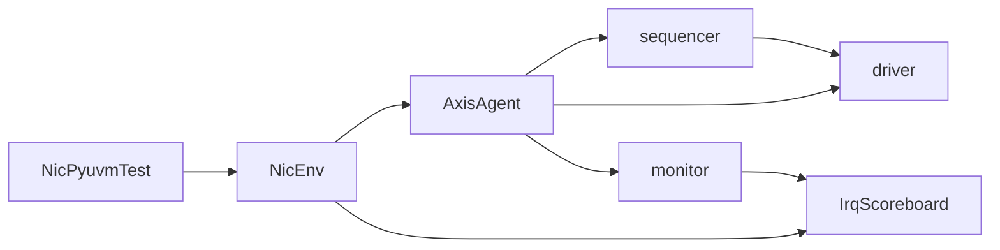

# pyuvm sandbox

IEEE UVM class library in Python (**pyuvm**) on **cocotb** and Verilator, driving the same AXI-Stream pins as `nic_rx`.

## Advantages

- Standard UVM layout: `uvm_test` → `uvm_env` → `uvm_agent` (sequencer, driver, monitor) and a scoreboard.
- Sequences and scoreboards stay in Python; the DUT stays SystemVerilog.
- Works with the Verilator already used by Pcap2HDL (`cocotb==1.9.2` with 5.032).
- Independent of root `make` / DPI-C pcap replay, so both benches can exist.

## Use cases

- Handshake bring-up on `nic_rx`: `tvalid` / `tready`, `tstart` / `tlast`, `irq_rx`.
- Teaching or practicing UVM phases and TLM on this DUT.
- Growing extra agents (CSR, more AXIS sequences) on the same `nic_rx` pins.

## What the test does

`PcapSeq` opens a `.pcap` through `dpi/pcap_reader.c` (libpcap, optional BPF), drives one AXIS beat per captured byte, and checks that `tlast` and `irq_rx` counts equal frames streamed. RSS hash is placed on `s_tuser`; IPv4 checksum fail on `s_tuser_err`.

## Run

From the repo root (venv once, then only this target). Same knobs as pcap replay: `PCAP`, `MAX_PACKETS`, `FILTER`. If `PCAP` is missing, `scripts/gen_pcap.py` writes `ci.pcap`.

```bash
python3 -m venv /tmp/pcap2hdl-pyuvm
/tmp/pcap2hdl-pyuvm/bin/pip install 'cocotb==1.9.2' pyuvm
make pyuvm
make pyuvm MAX_PACKETS=8
make pyuvm PCAP=ci.pcap MAX_PACKETS=8
make pyuvm FILTER='tcp' MAX_PACKETS=8
```

`MAX_PACKETS=8` streams the first eight frames of `traffic.pcap` into `nic_rx`. `FILTER='tcp' MAX_PACKETS=8` streams eight TCP frames. Both pass when `tlast` and `irq_rx` equal 8.

Gate: `NicPyuvmTest` passed and `PcapSeq streamed N frames`. Reference: [examples/pyuvm.log](../../examples/pyuvm.log). Site page: [docs/pyuvm.html](https://khademullah.github.io/Pcap2HDL/pyuvm.html).

## Diagrams

`make pyuvm MAX_PACKETS=8` is this pipeline: pcap bytes → UVM sequence → AXIS driver → `nic_rx`, with a monitor/scoreboard on the same bus.



**UVM layout (same run)**



